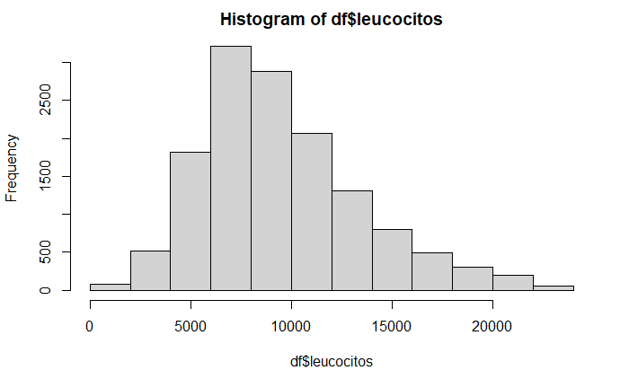
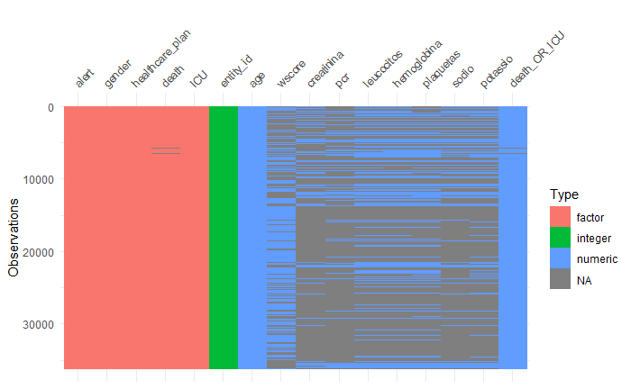
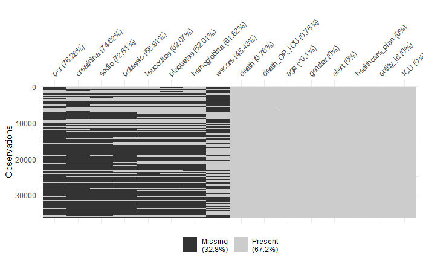
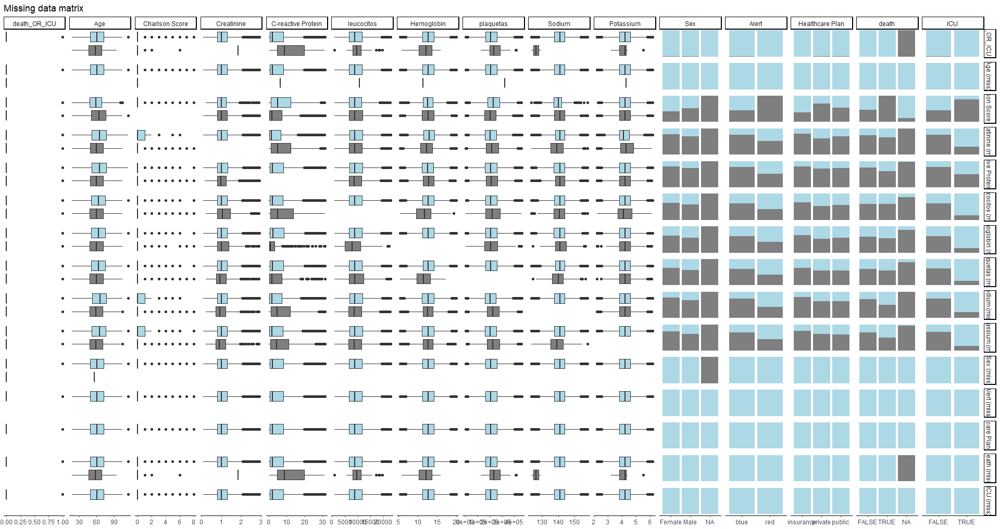
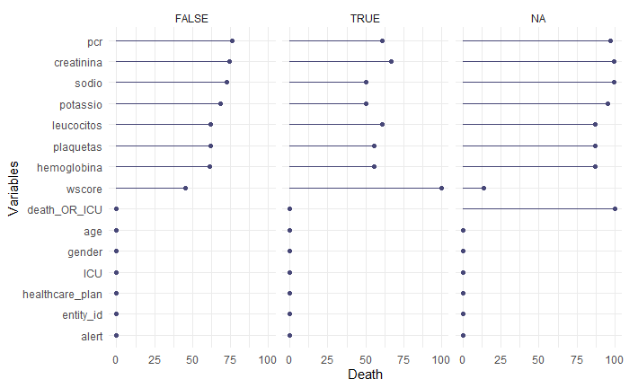
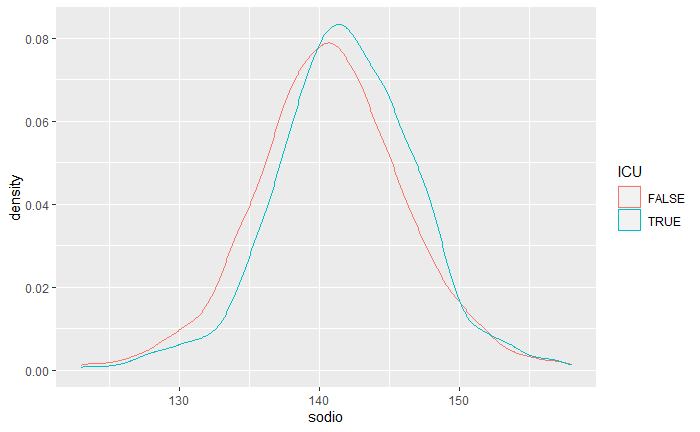
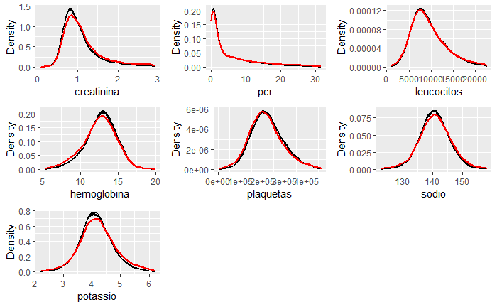
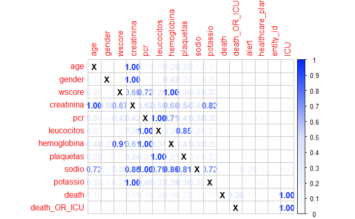
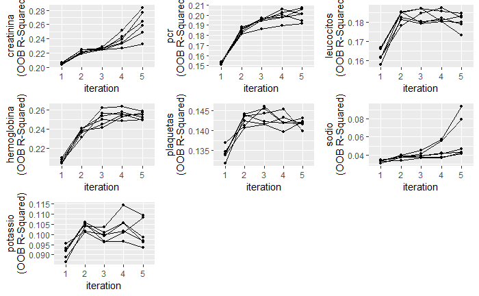

# MI_using_MiceRanger

## Pré-requisitos

Antes de começar, verifique se você atendeu aos seguintes requisitos:
* Package `miceRanger`
* Package `naniar`
* Package `finalfit`

## Sobre Multipla Imputação

Esse Script não é uma automatização do processo de M.I. para dados faltantes. Até porque não é recomendado fazer esse processo desse modo. Leia esse projeto como uma forma geral de lidar com a questão caso precise aplicar M.I. em seus dados. Veja o arquivo RMD para o código.

## Sobre dados faltantes e seus diferentes tipos
Existem três tipos de dados faltantes, e saber como eles se comportam é essencial para dois motivos: I) saber se posso usar tecnicas de imputação; e II) como tratar meu modelo de M.I. Os dados faltantes podem ser de três categorias MCAR, MAR e MNAR. Verifique a reflita sobre os seus dados. Caso eles sejam MCAR e MAR é necessario explicar o argumento no final do paper e pode seguir com esse protocolo, caso seja MNAR - utilizar outra opção.

* MCAR - Missing completely at Random - Dados que estão faltando aleatoriamente do data-set sem correlação com outros dados ou explicação importante dos dos missing; Forma mais fácil de resolver porém com dados reais dificilmente é essa a opção.
* MAR - Missing at Random - Dados que estão faltando aleatoriamente nos dados, e apresentam alguma correlação ou relação com alguma outra variavel em nosso dataset; tipo de dado faltante mais comum hoje. 
* MNAR - Missing not at Random - Dados que estão faltando por algum motivo importante durante a coleta dos dados, e não podem ser recuperado com o nosso dataset atual. É o mais dificil de identificar e resolver pois geralmente precisa de conhecimento prévio sobre a coleta ou comportamento dos dados.

## Remoção de outlier, % de missing e distribuição dos dados
Eu obtive melhores resultados trabalhando com um máximo de 50% de dados faltantes - mais do que isso a imputação ainda funciona, contudo a performance do modelo cai bastante (exemplo desse script). É essencial remover os outliers pois outliers vão influenciar na qualidade da imputação - no script existe uma formula que apliquei usando IQR. A distruição dos dados é essencial para difinir alguns parâmetros no processo; se for normal, é o mais fácil de resolver, caso seja Skewed, Bimodal ou números inteiros, existem opções especificas para tal.

## Verificar a relação de missing e outras variaveis
A maneira mais fácil de verificar se os seus dados são MCAR e MAR é verificar se existe algum padrão entre os dados faltantes e algum desfecho que acredita que possa influenciar nos dados. Aqui nesse exemplo mostro que existe diferença de dados faltantes caso o paciente fosse para UTI ou óbito - por esse motivo assumi que meus dados são MAR e que preciso considerar essas variaveis em meu modelo de M.I.

Verifique como os preditores se comportam entre os dados faltantes, pois pode ser necessario adicionar algum deles no processo de imputação, ou até remover. Se houver uma correlação clara entre os dados faltantes e a algum dos desfecho, não deixe de incluir no modelo de imputação.

Desenha uma ShadowMatrix (package naniar) para entender melhor como os dados se comportam entre Missing e não Missing, recomendo explorar as funcionalidades do package para entender melhor como desenhar o modelo ou como os dados estão faltantes.

## Modelo de imputação e plots de Diagnóstico 

* Parametros principais para cuidar:
* maxiters = Adiciona número de interações (Relevante - utilizar entre 5-15);
* m = Número de data-sets que ira produzir ao final do processo (5 é suficiente);
* num.threads = Se deseja deixar o processo mais rápido pelo numero de processadores;
* valueSelector = Utilize "meanMatch" caso seja uma variavel: Bimodal/Skewed ou valor Inteiro;

Após gerar seu primeiro modelo é possivel verificar a qualidade do mesmo usando plots de diagnóstico.

* Distribuição dos dados imputatos - Verifique se após imputação dados em preto estão parecidos com a linha em vermelho (muito importante);
* Erro de modelo - Verifica como o erro se comportou ao longo das interações (muito importante)
* Correlação entre data-sets - Verifique se existe uma correlação entre as interações (importante);
* Importancia da variantes no modelo - Verifique quais variaveis impactaram mais no modelo (importante);
* Variação na imputação entre os data-sets e os dados orignais - Serve para verificar o quão distantes os dados ficaram entre o data-set e a imputação (pouco importante);

## Referências

* https://stefvanbuuren.name/fimd/ch-introduction.html
* https://github.com/FarrellDay/miceRanger#Using-miceRanger
